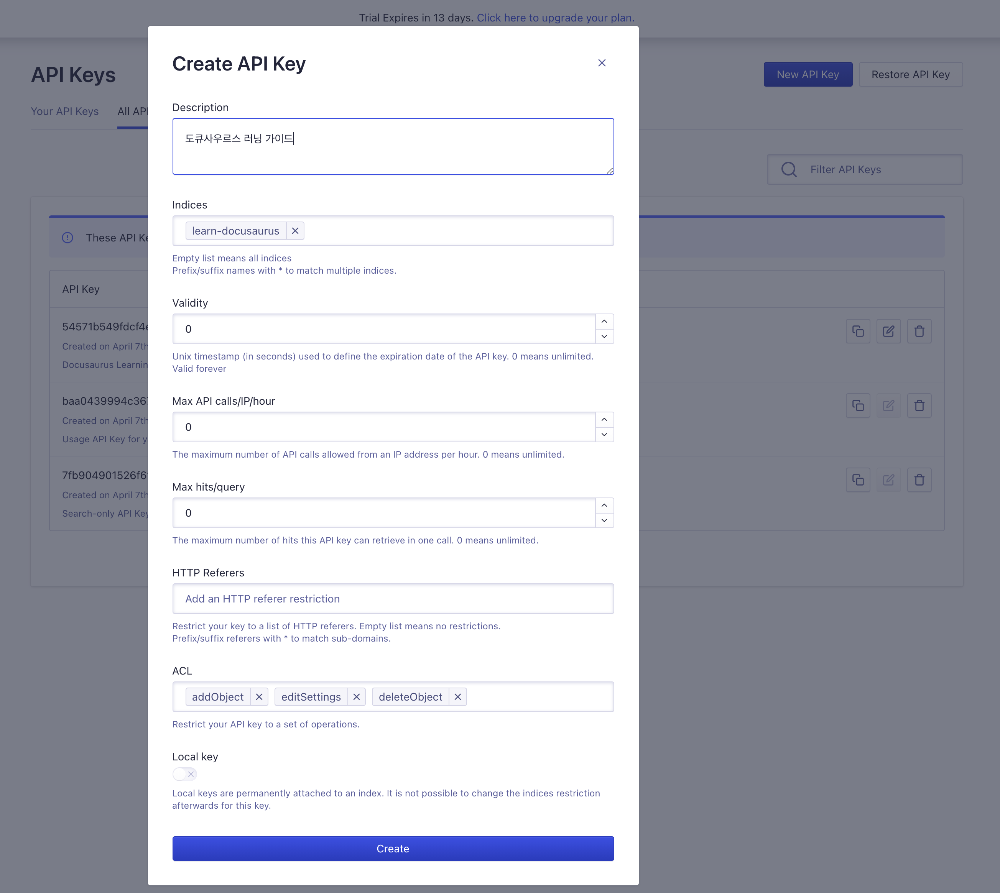
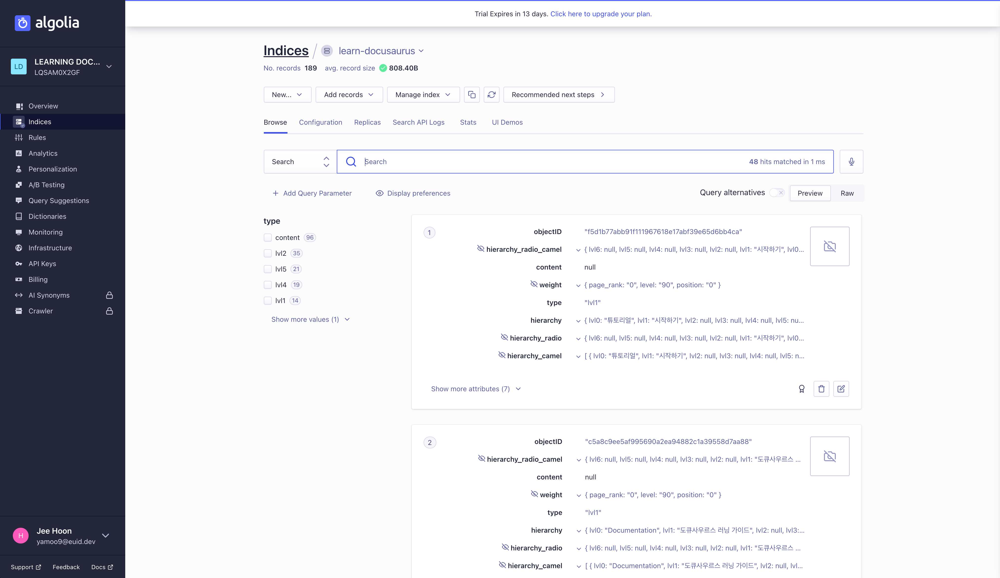
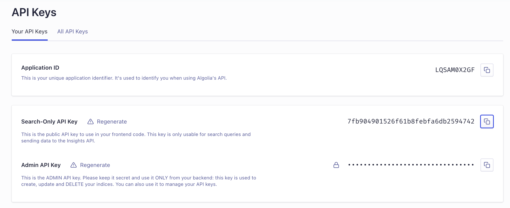

[Algolia DocSearch](https://docsearch.algolia.com/) 서비스는 24시간마다 웹 사이트의 콘텐츠를 크롤링하고 모든 콘텐츠를 Algolia 인덱스에 넣는 방식으로 작동합니다. 이렇게 크롤링 된 콘텐츠는 Algolia API를 사용하여 Front-End에서 직접 쿼리(query) 됩니다. 이처럼 작동하려면 웹 사이트가 공개되어야 합니다.
Algolia 서비스를 사용할 자격을 요청해 기다리는 방법도 있지만, [직접 Algolia DocSearch를 사용할 수 있도록 설정](https://docsearch.algolia.com/docs/run-your-own/)할 수도 있습니다.

## 환경설정

Algolia 애플리케이션 ID와 관리자 API 키를 환경 변수로 설정해야 합니다.
[Algolia 계정이 없는 경우 계정을 만들어야 합니다.](https://www.algolia.com/pricing)

- `APPLICATION_ID` → Algolia 앱 ID
- `API_KEY` → Algolia 색인(index)에 대한 쓰기 접근 권한이 있는 API 키

:::note ACL 설정
ACL 값을 `addObject`, `editSettings`, `deleteIndex`로 설정해야 합니다.
:::



`.env` 파일을 프로젝트 루트에 추가한 다음 Algolia 앱 ID, API 키를 입력하고 저장합니다.

```env title=".env"
APPLICATION_ID=LQSAM0X2GF
API_KEY=59571c541fdcf4k58aif514v99f49wfj
```

## Docker 크롤링

웹사이트 크롤링을 위해 [JSON 프로세서(jq)](https://github.com/stedolan/jq/wiki/Installation), [도커(Docker)](https://www.docker.com/products/docker-desktop)를 설치합니다. 설치가 마무리 되면 구성 파일을 작성한 다음 크롤링을 시작해야 합니다.

## 크롤링 구성 파일

[docusaurus-2.json](https://github.com/algolia/docsearch-configs/blob/master/configs/docusaurus-2.json) 설정을 참고해 
`config.json` 파일을 작성합니다. (`index_name`, `start_urls`, `sitemap_urls` 변경)

```json title="config.json"
{
  "index_name": "learn-docusaurus",
  "start_urls": [
    "https://learn-docusaurus.netlify.app/"
  ],
  "sitemap_urls": [
    "https://learn-docusaurus.netlify.app/sitemap.xml"
  ],
  "sitemap_alternate_links": true,
  "stop_urls": [],
  "selectors": {
    "lvl0": {
      "selector": "(//ul[contains(@class,'menu__list')]//a[contains(@class, 'menu__link menu__link--sublist menu__link--active')]/text() | //nav[contains(@class, 'navbar')]//a[contains(@class, 'navbar__link--active')]/text())[last()]",
      "type": "xpath",
      "global": true,
      "default_value": "Documentation"
    },
    "lvl1": "header h1",
    "lvl2": "article h2",
    "lvl3": "article h3",
    "lvl4": "article h4",
    "lvl5": "article h5, article td:first-child",
    "lvl6": "article h6",
    "text": "article p, article li, article td:last-child"
  },
  "strip_chars": " .,;:#",
  "custom_settings": {
    "separatorsToIndex": "_",
    "attributesForFaceting": [
      "language",
      "version",
      "type",
      "docusaurus_tag"
    ],
    "attributesToRetrieve": [
      "hierarchy",
      "content",
      "anchor",
      "url",
      "url_without_anchor",
      "type"
    ]
  },
  "conversation_id": [
    "833762294"
  ],
  "nb_hits": 16653
}
```

## 크롤링 명령 실행

`docker` 명령을 사용해 `.env`, `config.json` 파일을 읽어들여 웹 사이트를 크롤링 하도록 명령을 실행합니다.

```shell
docker run -it --env-file=.env -e "CONFIG=$(cat ./config.json | jq -r tostring)" algolia/docsearch-scraper
```

크롤링이 완료되면 Algolia 대시보드에서 결과를 살펴볼 수 있습니다.



## Algolia 설정

`docusaurus.config.js` 파일의 `themeConfig` 영역에 `algolia` 코드를 작성합니다.

```js {2-7} title="docusaurus.config.js"
themeConfig: {
  algolia: {
    // 검색 API 키
    apiKey: '7fb904901526f61b8febfa6db2594742',
    indexName: 'learn-docusaurus',
    appId: 'LQSAM0X2GF',
  },
  // ...
}
```

:::tip 검색 API 키
`apiKey` 값은 **Search-Only API Key** 값을 입력해야 합니다.


:::