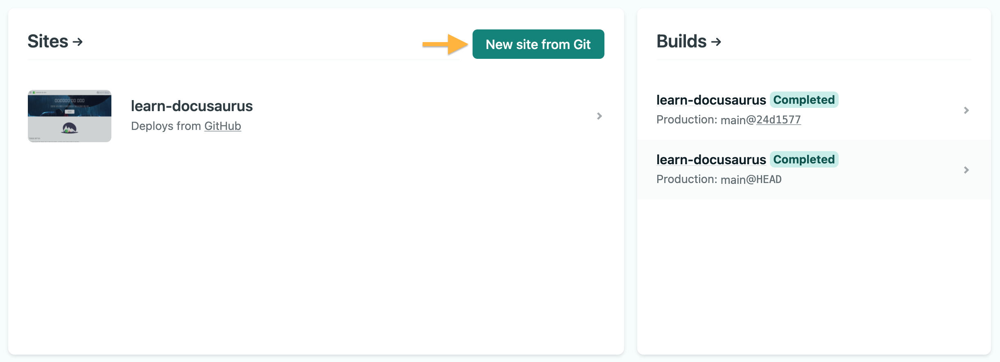
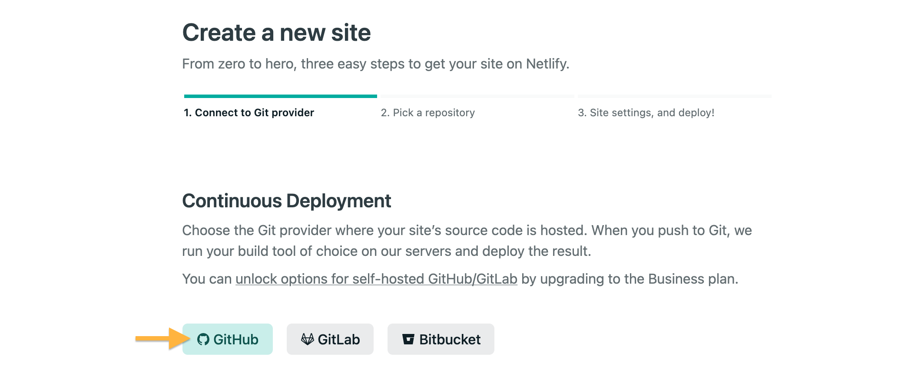
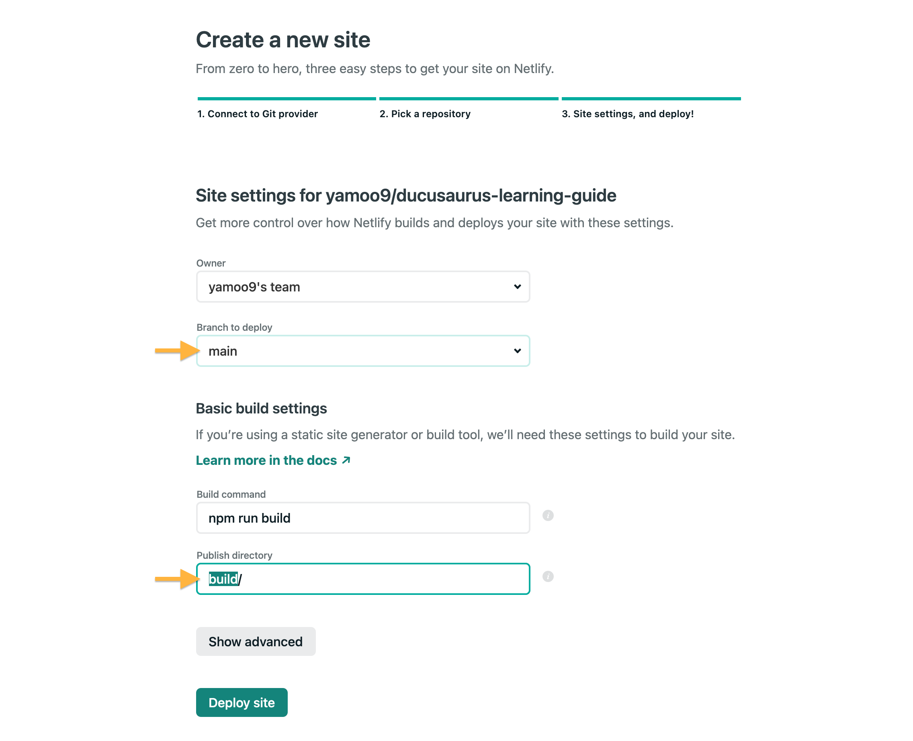
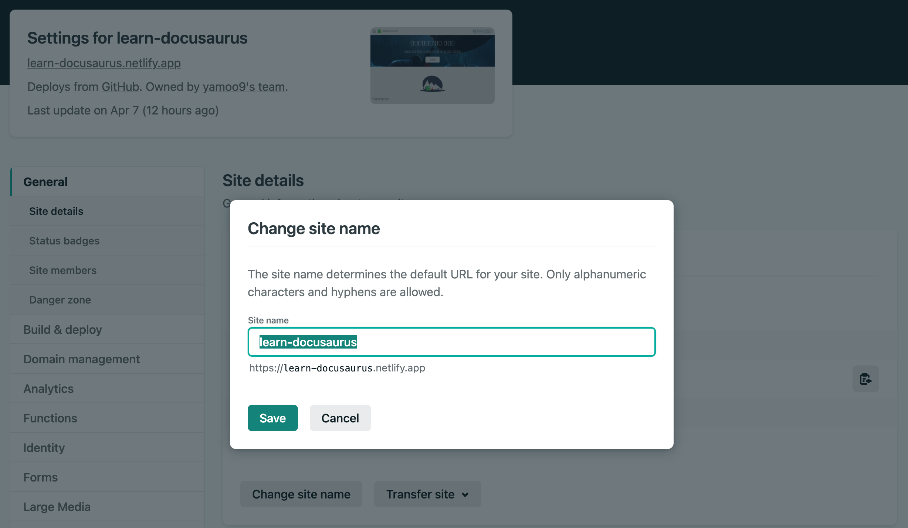
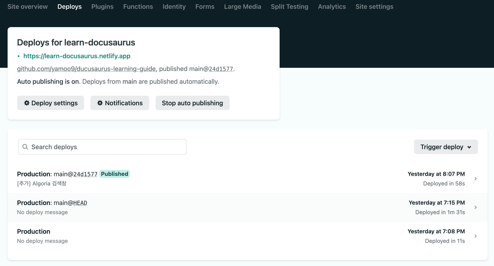

[Netlify](https://www.netlify.com/) 서비스를 사용해 웹사이트를 배포(deploy)하려면 `docusaurus.config.js` 파일을 다음과 같이 작성합니다. 
Netlify 사이트 URL은 배포 이후 입력해도 되지만, URL은 사용자 입맛에 맞게 변경 가능하므로 미리 입력해도 무방합니다.

```js {2-3} title="docusaurus.config.js"
module.exports = {
  url: 'https://learn-docusaurus.netlify.com',
  baseUrl: '/',
  // ...
}
```

Netlify 서비스 이용을 위해 가입한 후, GitHub 저장소와 연결하여 접근 권한을 설정해야 합니다.
Git을 사용해 새로운 사이트를 만들기 위해 `New Site from Git` 버튼을 눌러 진행합니다.



이어 연결할 Git 공급자로 GitHub을 선택합니다. 배포할 저장소를 선택한 후 Netlify 접근 권한을 부여합니다.



배포할 브랜치 및 빌드 명령, 빌드 결과가 출력될 디렉토리를 설정하고 사이트를 배포(Deploy site) 합니다.



배포에 성공하면 사이트 설정 페이지에서 "사이트 이름"을 사용자가 변경할 수 있습니다.



Netlify 서비스는 연결된 GitHub 저장소의 브랜치에 `push` 이벤트가 발생하면 자동 배포합니다. 



