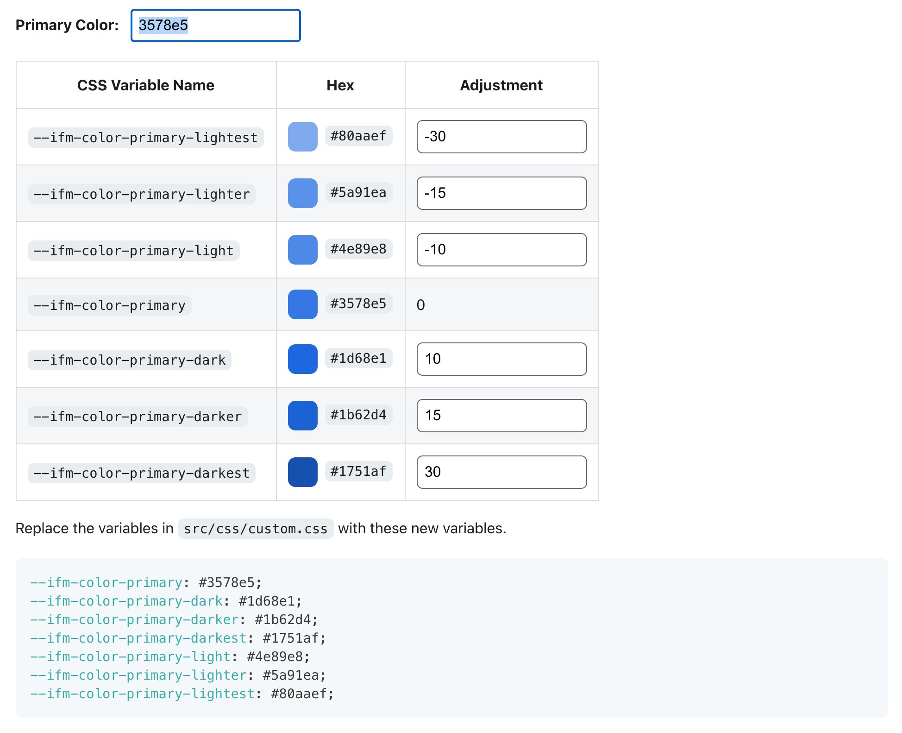

## 스타일 & 레이아웃

[classic 테마](https://github.com/facebook/docusaurus/tree/master/packages/docusaurus-preset-classic)를 사용하는 경우, 
`src/css/custom.css` 파일에 기본적으로 사용자 정의 CSS를 작성할 수 있습니다.

```js {7-9} title="docusaurus.config.js"
module.exports = {
  // ...
  presets: [
    [
      '@docusaurus/preset-classic',
      {
        theme: {
          customCss: [require.resolve('./src/css/custom.css')],
        },
      },
    ],
  ],
};
```

해당 파일에 작성한 모든 CSS는 글로벌 스코프에서 작동되며, 스트링 리터럴을 사용하여 직접 참조 할 수 있습니다. 
이 방법은 "CSS 작성에 대한 가장 전통적인 접근 방식"이며 소규모 웹 사이트에 적합한 방식입니다.

## Infima 사이트 스타일 설정

classic 테마는 [Infima](https://infima.dev/) 스타일 프레임워크를 사용합니다. Infima는 콘텐츠 중심의 웹 사이트(문서, 블로그, 랜딩 페이지 등)에 적합한 유연한 레이아웃과 UI 컴포넌트 스타일을 제공합니다. 보다 상세한 사용법은 [Infima 문서](https://infima.dev/docs/getting-started/introduction)를 참고하세요.

Infima는 각 색상의 7가지 음영(shades, 미묘한 색 차이)을 사용합니다. [Colorbox](https://www.colorbox.io/)를 사용해 선택한 기본 색상에서 조정된 다양한 음영을 찾아 사용하는 것이 좋습니다.

```css
/* 
  기본 Infima 변수를 재정의 할 수 있습니다.
  참고: https://bit.ly/3fSh09Y
*/
:root {
  --ifm-color-primary: #279f85;
  --ifm-color-primary-dark: #238f78;
  --ifm-color-primary-darker: #218771;
  --ifm-color-primary-darkest: #1b6f5d;
  --ifm-color-primary-light: #2baf92;
  --ifm-color-primary-lighter: #2db799;
  --ifm-color-primary-lightest: #34cdac;
}
```



## 다크 모드

다크 모드에서의 Infima 변수 값을 덮어 쓰려면 다음과 같이 작성하세요.

```css title="/src/css/custom.css"
:root[data-theme='dark'] {
  --ifm-color-primary: #4e89e8;
  --ifm-color-primary-dark: #5a91ea;
  
  /* 덮어 쓸 색상 설정 */
}

/* 덮어 쓸 스타일 */
[data-theme='dark'] .hero__subtitle {
  color: #fff;
}
```

## 스타일 방법론

Docusaurus 사이트는 React로 제작된 싱글 페이지 애플리케이션입니다. React 앱을 스타일링 하는 방식 그대로 스타일 할 수 있습니다.

### 글로벌 스타일

대부분의 개발자에게 익숙한 전통적인 스타일링 방법입니다.

```css title="/src/css/custom.css"
.purple-text {
  color: rebeccapurple;
}
```

```jsx {4}
function MyComponent() {
  return (
    <main>
      <h1 className="purple-text">아이 라이크 퍼플!</h1>
    </main>
  );
}
```


### CSS 모듈

[CSS 모듈](https://github.com/css-modules/css-modules)을 사용해 컴포넌트를 스타일 하려면? 스타일 파일 이름을 `*.module.css`로 작성해야 합니다.

```css title="styles.module.css"
.main {
  padding: 12px;
}

.heading {
  font-weight: bold;
}

.contents {
  color: #ccc;
}
```

```jsx {1,6,9,14}
import styles from './styles.module.css';

function MyComponent() {
  return (
    <main 
      className={styles.main}
    >
      <h1 
        className={styles.heading}
      >
        안녕! 도큐사우르스
      </h1>
      <article 
        className={styles.contents}
      >
        ...
      </article>
    </main>
  );
}
```


### CSS in JS

:::caution 주의
이 섹션은 현재 진행 중인 작업입니다. [풀 리퀘스트(PRs)](https://github.com/facebook/docusaurus/issues/1640) 환영합니다.
:::

### Sass

Sass를 사용하려면 [docusaurus-plugin-sass](https://github.com/rlamana/docusaurus-plugin-sass) 플러그인을 설치해야 합니다.
 이 플러그인은 글로벌 스타일, CSS 모듈 방식에서 모두 작동합니다.

```shell
npm i docusaurus-plugin-sass
```

`docusaurus.config.js` 파일을 열어 설치한 Sass 플러그인을 추가 설정합니다.

```js {3} title="docusaurus.config.js"
module.exports = {
  // ...
  plugins: ['docusaurus-plugin-sass'],
  // ...
}
```

#### Sass 글로벌 스타일

`@docusaurus/preset-classic`의 `customCss` 속성에 글로벌 스타일 설정할 Sass 파일 경로를 설정합니다.

```js title="docusaurus.config.js"
module.exports = {
  presets: [
    [
      '@docusaurus/preset-classic',
      {
        // ...
        theme: {
          customCss: [require.resolve('./src/css/custom.scss')],
        },
        // ...
      },
    ],
  ],
}
```

#### Sass 모듈

```scss title="styles.module.scss"
.main {
  padding: 12px;

  article {
    color: #ccc;
  }
}
```

```jsx {1,5}
import styles from './styles.module.scss'

function MyComponent() {
  return (
    <main className={styles.main}>
      <article>Lorem Ipsum</article>
    </main>
  )
}
```
